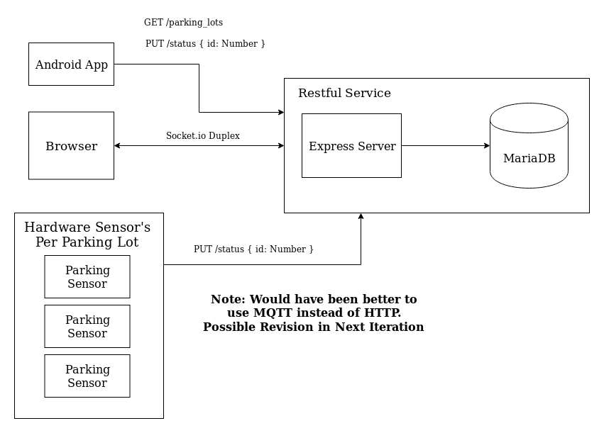

# Parking App Api

This project is used in completion for my Capstone 2.

Used as the restful endpoint and socket.io server for 3 Systems:

* [Parking Sensor][sensor]
* An Android App 
* A CodeIgniter Web Application (On the Browser)

*Note: I can't post the Android App as well as the CodeIgniter Web App since it was made by a colleague of mine, and it is hosted on Bitbucket*

The System Diagram

# Routes:

There are many routes that are created (due to Upfront design) but only the following are really used:

* `GET /parking_lots` returns the list of all parking lots in JSON form
* `PUT /status` should contain payload { id: <parkingLotId>, status: <0 -> available, 1 -> unavailable> }

# Realtime Updates

Each time the Server receives a `PUT /parking_lots/:id` request it broadcasts a `status_changed` event to all connected clients along with the updated parking lot.

Signature:

* `socket.on('status_changed', (parking_lot))`

[sensor]: https://github.com/Pofay/parking-sensor

